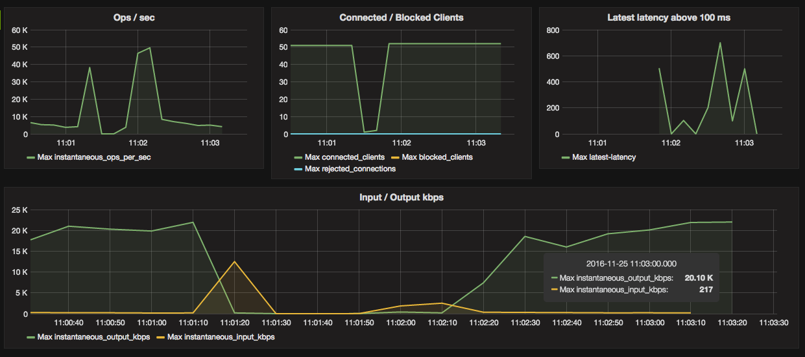

# redis-healthy

It retrieves metrics, periodically, from [Redis](http://redis.io) (or sentinel) (such as [`latency`](http://redis.io/topics/latency), `connected_clients`, `instantaneous_ops_per_sec` and others) and send it to the [Logstash](https://www.elastic.co/products/logstash).



## Metrics

```javascript
{
   client_longest_output_list:15,
   instantaneous_input_kbps:0,
   sync_partial_err:0,
   latency:361,
   connected_clients:398,
   blocked_clients:0,
   keyspace_hits:201980,
   client: 'app-redis',
   instantaneous_ops_per_sec:1092,
   instantaneous_output_kbps:504,
   sync_full:0,
   keyspace_misses:1093,
   mem_fragmentation_ratio:0,
   rejected_connections:0,
   sync_partial_ok:0
}
```

## Options

```javascript
// When you see a *, it means you need to pass this configuration
PROJECT="myMetrics" // * an identifier for the metrics, it'll be send as "client": PROJECT + "-redis"
PING_FREQUENCY="30" // frequency in seconds that the metrics are fetched default: 10

REDIS_HOST="singlehost:9090" // * redis host
REDIS_SENTINEL="y" // if you're using sentinel default: ""
REDIS_HOST="sentinel1:9090,sentinel1:9090,sentinel1:9090,"  // * if you're using redis sentinel, then provide hosts separated by commas
REDIS_PWD="f00d" // redis password default: ""
REDIS_MASTER_NAME="master" // redis sentinel master name default: ""
REDIS_LATENCY_THRESHOLD="150" // redis latency threshold in ms, default: ""
// when any command take longer than the threshold then it sends data about latency default: ""
REDIS_METRICS_TO_WATCH="client_longest_output_list,instantaneous_ops_per_sec"
// the fields you want to keep track from the output of the command "info"
// default: "client_longest_output_list,connected_clients,blocked_clients,rejected_connections,
// instantaneous_input_kbps,instantaneous_output_kbps,instantaneous_ops_per_sec,keyspace_hits,
// keyspace_misses,mem_fragmentation_ratio,sync_full,sync_partial_ok,sync_partial_err"
```

## Usage

```bash
REDIS_LATENCY_THRESHOLD="250" REDIS_HOST="localhost:6379" LOGSTASH_HOST="logstash.mine:8515"  PROJECT="myapp" go run main.go
```
